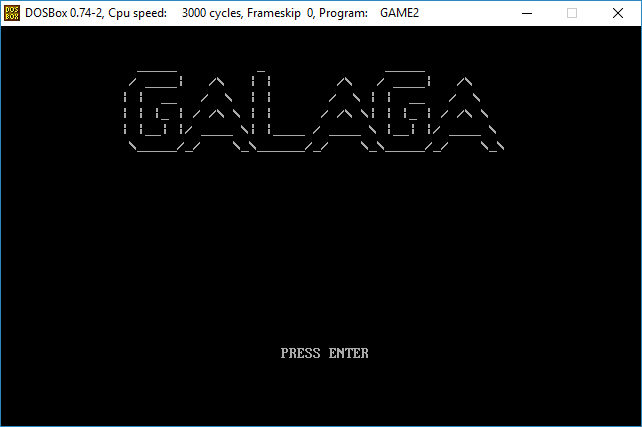
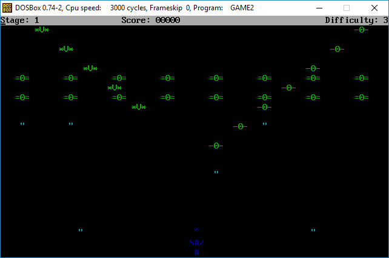
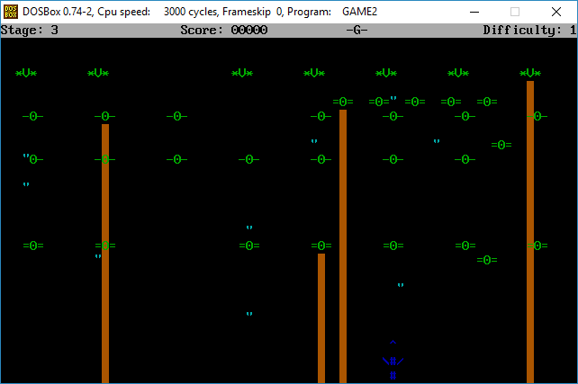

# galaga_xinu

This is a Galaga game we've had to create for the "Operating Systems and Real Time" class.  
This should be compiled and run in the Xinu operating system.  

This game tries to simulate the galaga game, with poor graphcs;)  
There are different enemies types whch move in different formation, movement patterns and speeds.  
Some enemies shoot bullets(all stages), some lasers(stage 2 and 3) and some start crashing into the player ship(stage 3).  
There are 3 difficulties, each one increases enemy units' movememnt speed.  
There are 3 levels: different levels have different kind of enemies and mifferent movement types for the enemy formations.  

Keys:  
Right/left arrows - navigation  
Up arrow - shooting  
G - God mode  
S - Mute  
C - clear stage  

Screen shots:  

